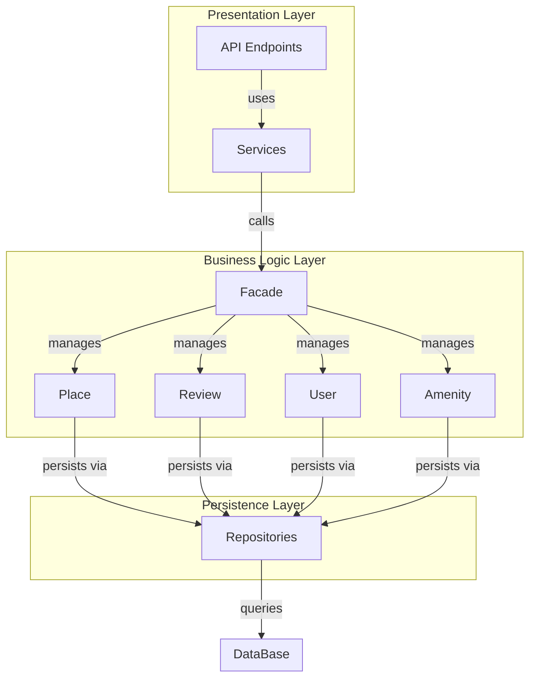
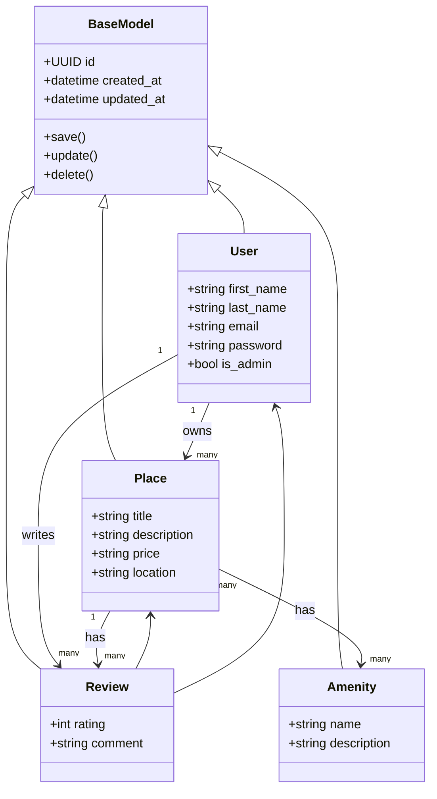
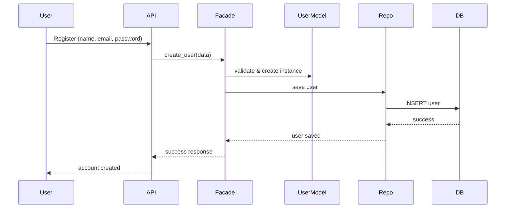
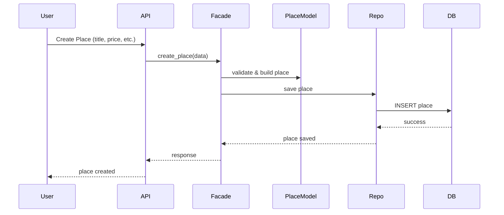
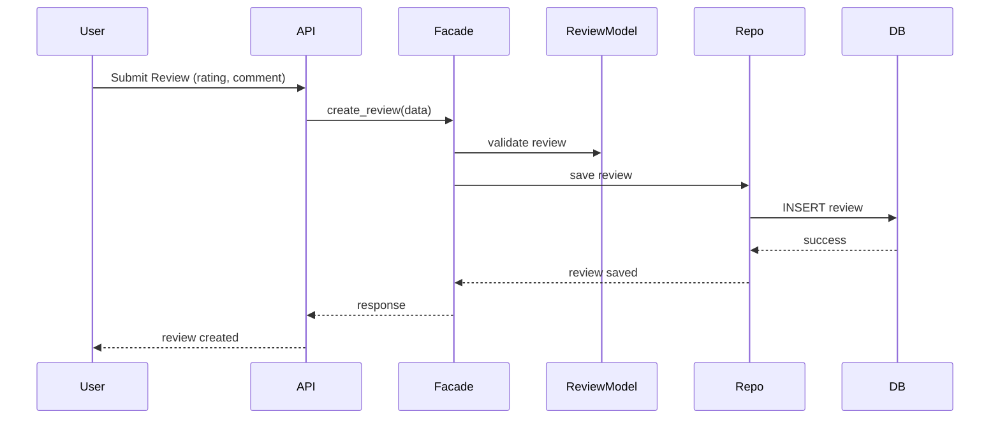
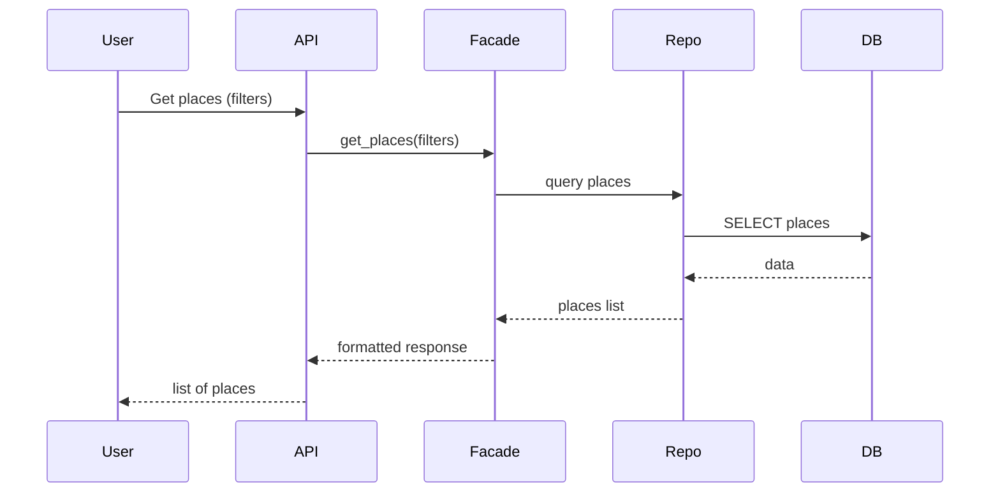

# HBnB Evolution – Technical Documentation (Part 1)

## 1. Introduction
This document provides a high-level overview of the architecture of the HBnB Evolution application. It describes the layered architecture, key components, and interactions between them using the facade pattern.

## 2. Architecture Overview
The application follows a three-layer architecture:

- Presentation Layer: Handles user interaction through APIs and services.
- Business Logic Layer: Contains the core models and business rules.
- Persistence Layer: Manages data storage and retrieval.

## 3.1 High-Level Package Diagram

## 3.2 Layer Responsibilities

### Presentation Layer
Handles incoming requests from users via API endpoints and services. It forwards requests to the facade.

### Business Logic Layer
Contains the core entities (User, Place, Review, Amenity) and implements business rules.

### Persistence Layer
Responsible for interacting with the database through repositories.

## 3.2 Facade Pattern
The facade pattern provides a unified interface between the presentation and business logic layers.

Instead of interacting directly with multiple components, the presentation layer communicates with a single facade, which simplifies the interaction and hides internal complexity.

## 4. Detailed Class Diagram (Business Logic Layer)

### Overview

This section presents the detailed class diagram of the Business Logic Layer of the HBnB Evolution application. It defines the main entities of the system, their attributes, and the relationships between them. The diagram is designed using UML notation and implemented using Mermaid.js.

### Class Diagram

## Entity Descriptions
### BaseModel

Base class for all entities in the system. It provides common attributes such as a unique identifier and timestamps for creation and updates, as well as basic persistence-related methods.

### User

Represents a system user. A user can own multiple places and write multiple reviews. Users can also be identified as administrators using the is_admin attribute.

### Place

Represents a property listed in the system. Each place belongs to a user and can have multiple reviews and amenities associated with it.

### Review

Represents a user-generated review for a specific place. Each review includes a rating and a comment and is linked to both a user and a place.

### Amenity

Represents a feature or service available at a place (e.g., Wi-Fi, parking, pool). Amenities can be associated with multiple places.

### Relationships Overview
A User can own multiple Places and write multiple Reviews
A Place belongs to one User, has multiple Reviews, and multiple Amenities
A Review is associated with one User and one Place
A Place and Amenity have a many-to-many relationship

## 5. Sequence Diagrams for API Calls

### Overview
This section presents sequence diagrams that illustrate how different API requests are processed in the HBnB Evolution application. Each diagram shows the interaction between the Presentation Layer, Business Logic Layer, and Persistence Layer.

## 5.1 User Registration

The user registration process involves validating user input, creating a new user entity, and storing it in the database.

## 5.2 Place Creation

The place creation flow allows a user to create a new property listing which is then persisted in the system.

## 5.3 Review Submission

A user can submit a review for a specific place. The review is validated and stored in the database.

## 3.4 Fetch Places

This flow retrieves a list of places based on optional filters provided by the user.