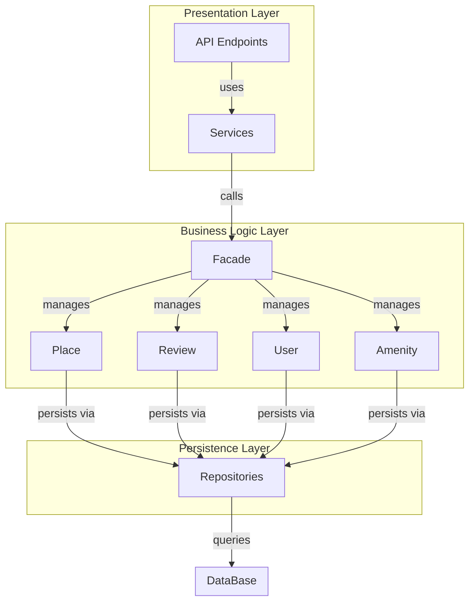

# HBnB Evolution – Technical Documentation (Part 1)

## 1. Introduction
This document provides a high-level overview of the architecture of the HBnB Evolution application. It describes the layered architecture, key components, and interactions between them using the facade pattern.

## 2. Architecture Overview
The application follows a three-layer architecture:

- Presentation Layer: Handles user interaction through APIs and services.
- Business Logic Layer: Contains the core models and business rules.
- Persistence Layer: Manages data storage and retrieval.

## 3. High-Level Package Diagram

## 4. Layer Responsibilities

### Presentation Layer
Handles incoming requests from users via API endpoints and services. It forwards requests to the facade.

### Business Logic Layer
Contains the core entities (User, Place, Review, Amenity) and implements business rules.

### Persistence Layer
Responsible for interacting with the database through repositories.

## 5. Facade Pattern
The facade pattern provides a unified interface between the presentation and business logic layers.

Instead of interacting directly with multiple components, the presentation layer communicates with a single facade, which simplifies the interaction and hides internal complexity.